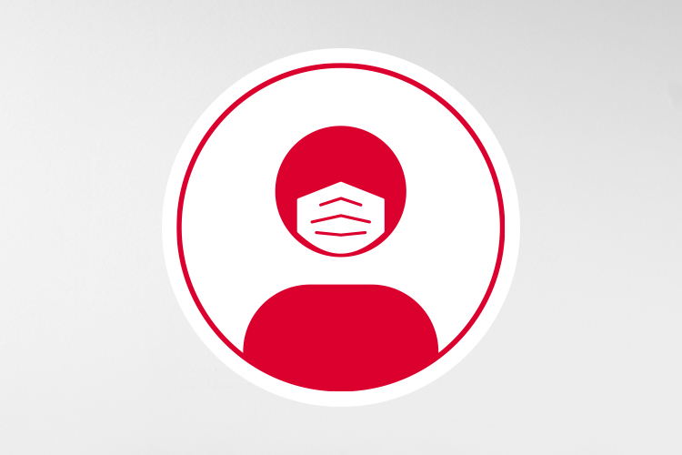

# Mask Detector

>Mask Detector is a face mask detection system which detects, tracks and monitors people who don't wear face masks in their offices.

## Get started

The project consists of 2 main components:
- **Deep Neural Network** for detecting whether a person is wearing a face mask or not (located in "[/ai](https://github.com/Maddie02/mask-detector/tree/main/ai)")
- **Server & HTML Django templates** which provide an easy to use user interface for employees to interact with (located in "[/mask_detect](https://github.com/Maddie02/mask-detector/tree/main/mask_detect)")

## Creator
- **Madlen Sarkisian** ([@Maddie02](https://github.com/Maddie02)) - AI, Web Application Development. Database